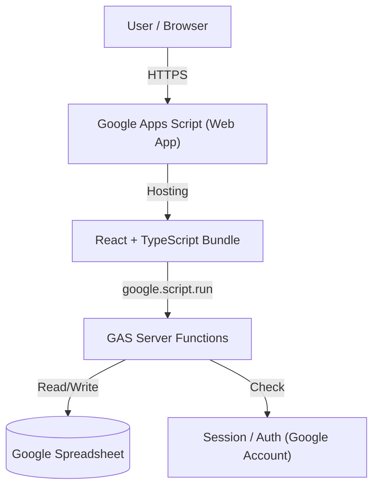

# 要件定義・基本設計書

## 1. プロジェクト概要・アーキテクチャ

本システムは、サーバーレスかつ追加コスト不要な環境として、Google Apps Script (GAS) をWebサーバー兼バックエンドロジック、Google Spreadsheetをデータベースとして利用するWebアプリケーションである。

### 1.1 システム構成図



---

## 2. 技術スタック

### 2.1 フロントエンド

- **フレームワーク:** React (Viteで単一HTMLにバンドル)  
- **言語:** TypeScript  
- **描画:** **React Flow**  
- **通信:** `google.script.run` (非同期クライアント-サーバー通信) with `@ciderjs/gasnuki`  
- **ルーティング:** `@ciderjs/city-gas`

### 2.2 バックエンド (GAS)

- **ランタイム:** V8 Engine  
- **デプロイ:** Clasp (Command Line Apps Script Projects) を利用したローカル開発。  
- **排他制御:** `LockService` (同時編集・承認時のデータ不整合防止)。

### 2.3 データベース (Spreadsheet)

- **構成:** 1つのスプレッドシートファイル内に複数のシート（タブ）を作成し、テーブルとして扱う。  
- **制約対策:** セルあたりの文字数制限（50,000文字）を考慮し、巨大なフローデータは分割または圧縮を検討（通常規模ならJSON文字列化で問題なし）。

---

## 3. データベース設計 (Spreadsheet Schema)

スプレッドシートの各「シート」をRDBのテーブルに見立てて定義する。

### 3.1 シート一覧

1. **System\_Users:** ユーザー情報・システムロール  
2. **System\_Groups:** グループ定義  
3. **Folders:** フォルダ階層構造  
4. **Folder\_Permissions:** フォルダ権限設定  
5. **Flows:** フローチャートのメタデータ  
6. **Flow\_Versions:** **\[重要\]** フローチャートの実データ（JSON）と履歴

### 3.2 詳細カラム定義

#### A. Flows シート (フロー管理簿)

| Column | Key | Description |
| :---- | :---- | :---- |
| A | `flow_id` | UUID (v4) |
| B | `folder_id` | 所属フォルダUUID |
| C | `title` | フロー名称 |
| D | `current_status` | 最新ステータス (DRAFT/PENDING/PUBLISHED) |
| E | `active_version_id` | 現在公開中のバージョンID (FK) |
| F | `updated_at` | 最終更新日時 |

#### B. Flow\_Versions シート (実データ・履歴)

| Column | Key | Description |
| :---- | :---- | :---- |
| A | `version_id` | **変更:** [リリース版] `YYYYMMDD`(-枝番) / [ドラフト版] `draft-{user}-{date}` |
| B | `flow_id` | 親フローID (FK) |
| C | `version_num` | 版数 (ソート用連番) |
| D | `status` | バージョン状態 (DRAFT/PENDING/PUBLISHED/REJECTED) |
| E | `json_data` | **変更:** マルチシート構造を含むJSONオブジェクト（詳細は6項参照） |
| F | `created_by` | 作成者のEmail |
| G | `created_at` | 作成日時 |
| H | `comment` | 申請コメント/承認・否認コメント（追記形式） |

※ `json_data` が5万文字を超える可能性がある場合、複数セルに分割保存するロジックをGAS側に実装する。

#### C. Folder\_Permissions シート (権限)

| Column | Key | Description |
| :---- | :---- | :---- |
| A | `permission_id` | UUID |
| B | `folder_id` | 対象フォルダ |
| C | `subject_email` | 対象ユーザーEmail (またはグループID) |
| D | `role` | VIEWER / EDITOR / APPROVER / ADMIN |

---

## 4. サーバーサイド機能設計 (GAS Functions)

Client側 (`google.script.run`) から呼び出される関数群。REST APIではないため、関数名がエンドポイントとなる。

### 4.1 共通・認証

- **`doGet(e)`**: Webアプリのエントリーポイント。Reactのビルド成果物（HTML）を返す。  
  `HtmlTemplate`に対して **`user`**: `Session.getActiveUser().getEmail()` を与え、フロントエンド側で出力スクリプトレットを利用し取得する。

### 4.2 データ操作関数

#### `saveDraft(flowId, flowDataJson)`

- **変更:**
  - バージョンID生成ルールを変更。実行ユーザーと日付に基づき `draft-{user}-{date}` を生成。
  - 同一IDが存在すれば上書き、なければ新規作成（`version_num`インクリメント）。

#### `approveFlow(flowId, versionId, comment, [graphData])`

- **変更:**
  - 引数に `graphData` (選別後のデータ) を追加。
  - 承認時に `graphData` が渡された場合、その内容で `json_data` を上書き更新する（チェリーピック承認）。
  - ステータスを `PUBLISHED` に更新すると同時に、`version_id` をリリース形式 `YYYYMMDD`（重複時は連番付与）に書き換える。

#### `getFlows()`

- **概要:** ダッシュボード用フロー一覧取得。
- **ロジック:**
  - 実行ユーザーがアクセス可能なフォルダ（`Folder_Permissions`）に属するフローのみをフィルタリングして返す。

---

## 5. GAS特有の非機能要件・制約事項

### 5.1 パフォーマンス対策

- **Spreadsheet APIの呼び出し回数削減:**  
  - ループ内で `sheet.getRange().setValue()` を繰り返すと非常に遅くなる。  
  - データ取得時は `sheet.getDataRange().getValues()` で二次元配列として一括取得し、メモリ上でフィルタリング・加工を行う。  
  - データ保存時も可能な限り配列を作成し `setValues()` で一括書き込みを行う。

### 5.2 セキュリティ・認証

- **Googleアカウント認証:**  
  - デプロイ時に「次のユーザーとして実行: **アクセスしたユーザー**」「アクセスできるユーザー: **ドメイン内**」に設定する。  
  - これにより、アプリ利用者のEmailアドレスを `Session.getActiveUser().getEmail()` で取得し、これをIDとしてRBAC制御を行う。

### 5.3 デプロイ・開発フロー

- **ローカル開発:** React \+ Vite で開発（`@ciderjs/gasnuki`を利用したモックデータを使用）。  
- **ビルド:** `vite build` で `dist` フォルダ生成（`vite-plugin-singlefile` 、`vite-plugin-google-apps-script` を利用し、JS/CSSをHTMLにインライン化）。  
- **アップロード:** `clasp push` でGASプロジェクトへアップロード。

---

## 6. データ構造サンプル (Spreadsheetセル格納イメージ)

### A. Flow\_Versions シートの `json_data` カラム

マルチシート対応のため、データ構造を以下のように変更する。

```json
{
  "activeSheetId": "sheet-1",
  "sheets": [
    {
      "id": "sheet-1",
      "name": "Main Process",
      "nodes": [...],
      "edges": [...]
    },
    {
      "id": "sheet-2",
      "name": "Sub Process A",
      "nodes": [...],
      "edges": [...]
    }
  ]
}
```

### B. Folder\_Permissions シート

```csv
permission_id, folder_id, subject_email, role
"p-001", "f-sales", "yamada@example.com", "EDITOR"
"p-002", "f-sales", "tanaka@example.com", "APPROVER"
"p-003", "f-sales", "all-sales@example.com", "VIEWER"
```

## 7. 機能要件詳細 (UI/UX Specification)

### 7.1 エディタ機能 (Editor)

#### A. レイアウト・操作

- **グリッドシステム:**
  - 基本グリッド単位: $20\text{px}$
  - スロットサイズ: $180\text{px} \times 100\text{px}$（横7ユニット＋余白 × 縦3ユニット＋余白）
  - スロット内余白: 左右計 $40\text{px}$（ノードはスロット中央に配置）、上下 $20\text{px}$ オフセット
- **スナップ動作:**
  - 通常ノード: スロット中央に自動吸着
  - アノテーション: 20pxグリッドで自由配置
  - スイムレーン・矢羽根: スロット交点にスナップ
- **マルチシート:** 1つのフロー内で複数のキャンバス（シート）を作成・切り替え可能とする。
- **フォーマット修正:** ボタン押下により、BPMNルールの検証（バリデーション）と、全ノードのグリッド強制吸着（自動整列）を行う。
- **ノードロック:** 誤操作防止のため、特定のノードの移動・削除・接続を禁止するロック機能を提供する。
- **範囲選択の除外:** スイムレーン（背景要素）は、範囲選択（ドラッグ/Ctrl+A）の対象から除外する。

#### B. BPMNカスタムノード仕様

全ノード共通で、接続ハンドルはホバー時のみ表示し、上下左右どこでも起点・終点となれるようにする。

##### ノードサイズ一覧

| カテゴリ | ノード種別 | サイズ (px) | 備考 |
| :--- | :--- | :--- | :--- |
| **横長ノード** | タスク | $140 \times 60$ | 7×3グリッドユニット |
| - | メッセージングタスク | $140 \times 60$ | 送信/受信アイコン付き |
| - | 判断 (Decision) | $140 \times 60$ | 菱形、条件テキスト内部記載 |
| - | データベース | $140 \times 60$ | 一重円柱デザイン |
| **正方形ノード** | イベント (開始/終了) | $60 \times 60$ | 3×3グリッドユニット |
| - | ゲートウェイ | $60 \times 60$ | 菱形、内部にX/+/○ |
| - | メッセージイベント | $60 \times 60$ | 二重丸＋メールアイコン |
| - | タイマーイベント | $60 \times 60$ | 開始(一重)、中間(二重) |
| - | ジャンプ | $60 \times 60$ | 送り手/受け手ペア |
| **可変サイズ** | スイムレーン | 初期 $2700 \times 300$ | スロット単位でリサイズ可能 |
| - | 矢羽根 | 初期 $2700 \times 100$ | スロット単位でリサイズ可能 |
| - | アノテーション | 初期 $160 \times 80$ | 20px単位で自由リサイズ |

##### ノード詳細仕様

| ノード種別 | 仕様・挙動 |
| :--- | :--- |
| **スイムレーン** | ・ヘッダー（タイトル部）のみドラッグ移動可能。<br>・ボディ（背景）のドラッグはキャンバス移動（パン）として扱う。<br>・リサイズ方向を制限（横向きは右・下のみ）。ヘッダー色は変更可能。 |
| **メッセージイベント** | ・送信（黒塗り）、受信（白抜き）を明確化。<br>・データ連携がある場合、接続方向に合わせてハンドル位置を動的に調整。<br>・ラベルスタイル：送信は赤太文字、受信は標準。 |
| **アノテーション** | ・20pxグリッドで自由配置可能。接続方向に応じて強調ラインの位置を動的に変更。 |
| **タイマー** | ・開始（一重円）と中間（二重円）のデザイン使い分け。 |
| **ジャンプ** | ・クリックにより対応する遷移先へ画面移動（シート跨ぎ対応）。 |

### 7.2 閲覧・承認機能 (Viewer)

#### A. 画面構成

- **レスポンシブ対応:** モバイル端末では右サイドバー（詳細・履歴）をドロワー（Sheet）に格納し、閲覧領域を確保する。
- **ダークモード:** システム設定またはユーザー切り替えにより、UIおよびキャンバス内のノード配色を最適化する。

#### B. 差分確認と承認 (Diff & Cherry-pick)

- **Diff View:**
  - ステータスが `PENDING` の場合、現行の公開バージョンと比較を行う。
  - 追加（青）、削除（赤）、変更（緑）を色分けして表示する。
- **チェリーピック承認:**
  - 検出された差分に対し、個別に「採用（Apply）」か「却下（Revert）」を選択可能とする。
  - 承認実行時、却下された変更を取り消した状態で公開バージョンを作成する。

#### C. エクスポート

- **JSON出力:** 現在のフローデータ（メタデータ＋グラフ）をJSON形式でクリップボードにコピー可能とする。
